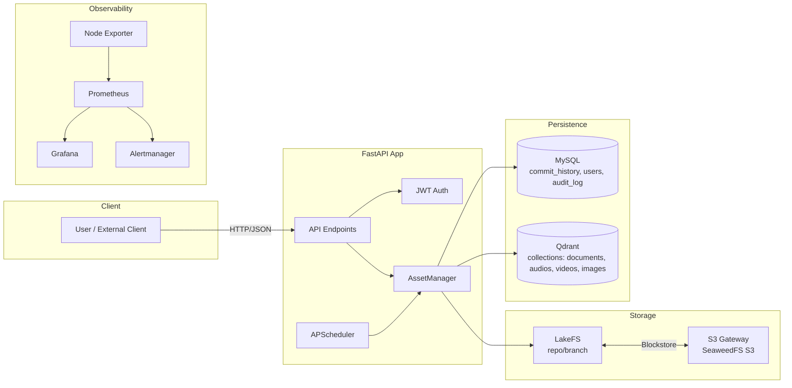
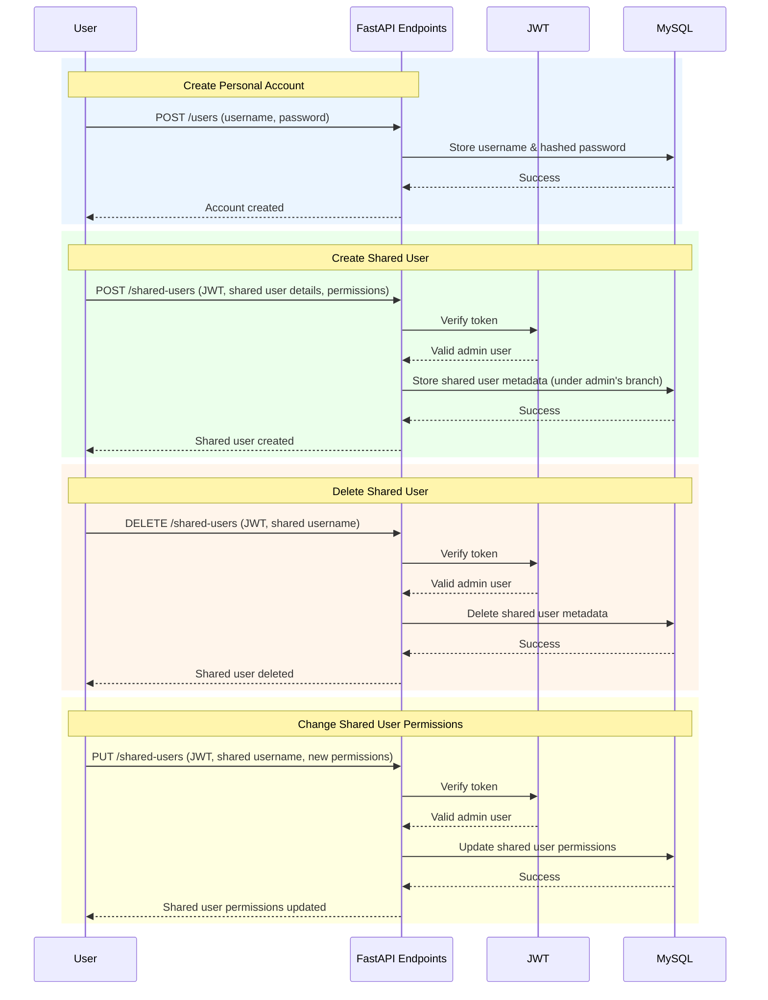
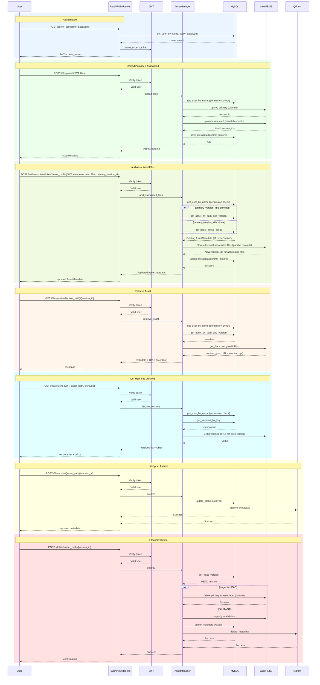

# 🚀 Asset Management Service

---

## Overview

This project is an **Asset Management Service** designed to handle the storage, retrieval, and management of digital assets with versioning, access control, and lifecycle management (upload, archive, destroy). It uses a microservices architecture with FastAPI, MySQL, Qdrant, lakeFS, and SeaweedFS for object storage, all orchestrated using Docker Compose.

The system includes a full observability stack (Prometheus, Grafana, Alertmanager, Node Exporter) for monitoring and alerting, ensuring high reliability and operational visibility.

---

## 📦 Features

* **Multi-Format Asset Storage**: Upload images, videos, documents, audio, and other files with automatic MIME type detection.
* **Versioning & Replication**: Full file versioning is supported by lakeFS, with high availability provided by a 3-master, 4-volume SeaweedFS cluster using 011 replication.
* **Metadata & Access Control**: Store structured metadata and enforce role-based access control (RBAC) in MySQL.
* **Vector Search**: Store and query asset metadata using Qdrant for vector-based search capabilities.
* **Authentication & Authorization**: JWT-based authentication with role-based access control (RBAC) for managing permissions (read, archive, destroy, list).
* **Automated Lifecycle Management**: Automatically archive and destroy assets based on configurable TTL (time-to-live) settings using APScheduler.
* **RESTful API**: Expose endpoints for uploading, downloading, archiving, destroying, and managing access policies for assets.
* **Scalable Architecture**: Deployed using Docker Compose with services for the application, MySQL, Qdrant, and SeaweedFS (master, volume, filer, and S3).
* **Production-Grade Monitoring**: Full observability with Prometheus metrics, Grafana dashboards, and Alertmanager alerts.
* **Centralized Backup**: Continuous backup of SeaweedFS filer metadata to the `./backup` directory.

---

## System Architecture Overview



---

## 📁 Project Structure

```
.
├── asset_management/           # Core application code
│   ├── client.py               # High-level asset operations
│   ├── config.py               # Configuration via Pydantic
│   ├── database.py             # Async MySQL interactions
│   ├── endpoints.py            # FastAPI routes and scheduler
│   ├── __init__.py
│   ├── models.py               # Data models
│   ├── object_store.py         # S3-compatible storage logic
│   ├── utils.py                # Utility functions
│   └── vector_store.py         # Qdrant integration
│
├── docker-compose.yaml         # Full service orchestration
├── Dockerfile                  # Application container definition
├── requirements.txt            # Python dependencies
├── README.md                   # This file
├── CHANGELOG.md                # Version history and release notes
├── .env.example                # Environment variable template
├── ensure_nfs_dirs.sh          # Script to create NFS directories from .env
├── test_api.ipynb              # API testing notebook
├── test_api.py                 # API testing script
│
└── docker_compose_settings/    # External service configurations
    ├── seaweedfs/              # master.toml, filer_generated.toml, filer-entrypoint.sh, replication.toml
    ├── prometheus/             # prometheus.yml, alert_rules.yml
    ├── lakefs/gc-runner        # Dockerfile, entrypoint.sh, run-gc.sh
    ├── alertmanager/           # alertmanager.yml
    └── grafana/provisioning/   # Datasources and dashboards
```

---

## ⚙️ Prerequisites

* [**Docker and Docker Compose**](https://docs.docker.com/compose/) : For running the services.
* **Python 3.10+** : For local development (if not using Docker).
* **Environment Variables** : Create a `.env` file with the required configurations (see Configuration).

---

## 🛠️ Setup and Installation

1. **Configure Environment Variables**:

Create a `.env` file in the project root from the provided example:

```bash
cp .env.example .env
```

* Edit the `.env` file with your desired configuration. 
  * **Ensure the `S3_PUBLIC_URL` is set correctly** (usually http://your-ip-address:8333 for local development).
  * **`NFS_EXPORT/BASE_DIR` must be either a new directory or an existing directory that can be safely cleared before initializing storage**.

2. **Build and Run with Docker Compose**:

```bash
# Create new NFS directories (will remove existing directories)
sudo bash ensure_nfs_dirs.sh
docker compose up --build -d
```

This command will start all containers, including the application, database, storage cluster, and monitoring stack.

3. **Verify the Services**:

Check the status of all containers:

```bash
docker compose ps
```

Monitor logs for the application:

```bash
docker compose logs -f
```

---

## ⚙️ NFS Mount Configuration for Docker Services

To properly mount NFS-shared directories in Docker Compose, the workflow is divided into three parts:

### 1. Define Required Directories (`.env`)

All directories to be mounted are defined in .env:

```yaml
# NFS settings (SeaweedFS will be mounted at ${NFS_SERVER}:${NFS_EXPORT}/${BASE_DIR})
NFS_SERVER=<NFS_SERVER_IP>
NFS_EXPORT=/raptor
BASE_DIR=seaweedfsTest
SUB_DIRS="admin s3 backup filer vol1 vol2 vol3 vol4 master1 master2 master3"
TMP_MNT=/opt/raptor
```

This ensures all required mount points are declared in a single place.

---

### 2. Automatically Ensure Directories Exist (`ensure_nfs_dirs.sh`)

A helper script reads `.env` and creates the corresponding directories on the NFS server.
The script automatically loads values from `.env`, mounts the NFS export temporarily, and ensures the directory structure exists:
Usage:

```bash
sudo bash ensure_nfs_dirs.sh
```

---

### 3. Configure NFS Volumes in `docker-compose.yaml`

Volumes in `docker-compose.yaml` reference environment variables defined in `.env`.
Example configuration for SeaweedFS master nodes:

```yaml
volumes:
  seaweedfs_master1:
    driver: local
    driver_opts:
      type: "nfs"
      o: "addr=${NFS_SERVER},nfsvers=4"
      device: ":${NFS_EXPORT}/${BASE_DIR}/master1"

  seaweedfs_master2:
    driver: local
    driver_opts:
      type: "nfs"
      o: "addr=${NFS_SERVER},nfsvers=4"
      device: ":${NFS_EXPORT}/${BASE_DIR}/master2"

  seaweedfs_master3:
    driver: local
    driver_opts:
      type: "nfs"
      o: "addr=${NFS_SERVER},nfsvers=4"
      device: ":${NFS_EXPORT}/${BASE_DIR}/master3"
```

Other directories (volumes, filer, s3, admin, backup) are configured in the same way, using the same `${NFS_SERVER}`, `${NFS_EXPORT}` and `${BASE_DIR}` environment variables.

---

### 📌 Notes

* The `.env` file contains all necessary configuration values:
  * NFS server address
  * NFS export path
  * Temporary mount path
* Docker Compose volumes reference `.env` variables to avoid hardcoding NFS paths.
* `ensure_nfs_dirs.sh` prepares the NFS bind-mount directories used by certain containers (i.e., SeaweedFS) **before** the containers start.  
  Since `docker compose down -v` does **not** remove old data on NFS-mounted paths, if you want to **shut down the old services and start clean ones**, you must run the script **after** `docker compose down -v` and **before** `docker compose up -d`.  
  This ensures all directories are freshly created and avoids conflicts between old and new data:

  ```bash
  docker compose down -v
  sudo bash ensure_nfs_dirs.sh
  docker compose up -d
  ```

---

## 🔧 Configuration

The application uses environment variables defined in the `.env` file, managed by the `Settings` class in `config.py`.

<details>
<summary>Configuration Variables (click to expand)</summary>

| Variable                                                                   | Description                                                                                                                                                                   |
| :------------------------------------------------------------------------- | :---------------------------------------------------------------------------------------------------------------------------------------------------------------------------- |
| `S3_ENDPOINT`                                                              | **Internal Endpoint**: The URL for the application (`app` service) to connect to the SeaweedFS S3 gateway **within the Docker network**. Example: `http://seaweedfs-s3:8333`. |
| `S3_PUBLIC_URL`                                                            | **External Download URL**: Base URL for generating **public presigned download links**, reachable by external clients. Example: `http://<YOUR_IP>:8333`.                |
| `S3_BUCKET`                                                                | The S3 bucket name where all assets are stored, e.g., `lakefs` or `asset-management`.                                                                                         |
| `AWS_ACCESS_KEY` / `AWS_SECRET_KEY`                                        | Access key and secret key for authenticating with the S3-compatible SeaweedFS service.                                                                                        |
| `VOLUME_SIZE_LIMIT_MB`                                                     | Maximum storage capacity (in MB) for each SeaweedFS volume. Example: 512                                                                          |
| `MAX_NUMBER_OF_VOLUMES`                                                    | Maximum number of volumes allowed per SeaweedFS volume server. Example: 100.                                                                                                  |
| `MYSQL_HOST` / `MYSQL_PORT`                                                | Hostname and port for the MySQL database service. Within Docker network, host is typically `mysql`.                                                                           |
| `MYSQL_ROOT_PASSWORD` / `MYSQL_USER` / `MYSQL_PASSWORD` / `MYSQL_DATABASE` | MySQL root password, application user, user password, and database name used by the application.                                                                              |
| `QDRANT_HOST` / `QDRANT_PORT`                                              | Hostname and port for the Qdrant vector database. Within Docker network, host is typically `qdrant`.                                                                          |
| `JWT_SECRET_KEY`                                                           | Secret key used to sign and verify JWT tokens. Must be strong and unique.                                                                                                     |
| `JWT_ALGORITHM`                                                            | Cryptographic algorithm used for JWT. Typically `HS256`.                                                                                                                      |
| `ACCESS_TOKEN_EXPIRE_MINUTES`                                              | Lifespan of JWT access tokens in minutes. Example: 30.                                                                                                                        |
| `TIMEZONE`                                        | Used to unify time definition across services. Example: Asia/Taipei                                                           |
| `GF_SECURITY_ADMIN_USER` / `GF_SECURITY_ADMIN_PASSWORD`                    | Username and password for Grafana dashboard login.                                                                                                                            |
| `LAKEFS_ENDPOINT`                                                          | Internal endpoint for the application to connect to lakeFS within Docker network.                                                                                             |
| `LAKEFS_ACCESS_KEY` / `LAKEFS_SECRET_KEY`                                  | Credentials for the application to authenticate with lakeFS.                                                                                                                  |
| `LAKEFS_AUTH_ENCRYPT_SECRET_KEY`                                           | Encryption key used by lakeFS for authentication-related operations.                                                                                                          |
| `LAKEFS_REPOSITORY`                                                        | Name of the repository in lakeFS used by the application. Example: `asset-management`.                                                                                        |
| `LAKEFS_PRE_SIGNED_EXPIRY`                                                 | Default expiry duration for lakeFS presigned URLs. Example: `20m` for 20 minutes.                                                                                             |
| `LAKEFS_DEFAULT_RETENTION_DAYS`                                            | Default retention period (in days) applied to objects across all branches unless overridden.                                                                                  |
| `LAKEFS_MAIN_BRANCH_RETENTION_DAYS`                                        | Retention period (in days) specifically for the `main` branch.                                                                                                                |
| `GC_CRON_SCHEDULE`                                                         | Cron expression defining garbage collector schedule. Example: `"0 2 * * *"` runs daily at 2:00 AM.                                                                            |
| `NFS_SERVER`                                                               | Hostname or IP of the NFS server for mounting shared directories.                                                                                                             |
| `NFS_EXPORT`                                                               | Exported path on the NFS server. Example: `/raptor`.                                                                                                                          |
| `BASE_DIR`                                                                 | Base directory under the NFS export where application data will be stored. Example: `seaweedfs`.                                                                              |
| `SUB_DIRS`                                                                 | Space-separated list of subdirectories to create under `BASE_DIR`. Example: `"admin s3 backup filer vol1 vol2 vol3 vol4 master1 master2 master3"`.                            |
| `TMP_MNT`                                                                  | Local temporary mount path for NFS during initialization. Example: `/opt/raptor`.                                                                                             |
| `SMTP_SMARTHOST`                                                           | SMTP server address and port. Example: `smtp.gmail.com:587`                                                                                               |
| `SMTP_FROM_EMAIL`                                                          | Sender email address for alerts. Example: `your_email@gmail.com`                                                                                          |
| `SMTP_AUTH_USERNAME`                                                       | SMTP authentication username (usually same as `SMTP_FROM_EMAIL`).                                                                                         |
| `SMTP_AUTH_PASSWORD`                                                       | SMTP authentication password or App Password (not regular account password).                                                                       |
| `SMTP_HELLO_DOMAIN`                                                        | Optional, SMTP HELO domain, usually `localhost`.                                                                                                          |
| `ALERT_EMAIL_TO`                                                           | Recipient email address for alerts. Example: `admin@example.com`.                                                                                         |
| `AUTO_DAILY_ARCHIVE_TIME` | Time of day to automatically archive assets daily. Format: `HH:MM`. Example: `00:00`. |
| `AUTO_DAILY_DESTROY_TIME` | Time of day to automatically destroy assets daily. Format: `HH:MM`. Example: `01:00`. |

</details>

---

## 🌐 Service Access

Once all services are running, you can access the following endpoints:

| Service                      | URL                                                   | Port  |
| :--------------------------- | :---------------------------------------------------- | :---- |
| **FastAPI Swagger UI** | [http://localhost:8000/docs](http://localhost:8000/docs) | 8000  |
| **lakeFS UI** | [http://localhost:8001](http://localhost:8001) | 8001  |
| **SeaweedFS Admin UI** | [http://localhost:23646](http://localhost:23646)         | 23646 |
| **Grafana Dashboard**  | [http://localhost:3030](http://localhost:3030)           | 3030  |
| **Prometheus**         | [http://localhost:9090](http://localhost:9090)           | 9090  |


<details>
<summary>🔌 Port usage (click to expand)</summary>

This table lists the port usage for each service in the `asset_management`.

| Service                                 | Container Port(s) | Host Port(s)      | Description                   |
| --------------------------------------- | ----------------- | ----------------- | ----------------------------- |
| **app**                                 | 8000              | 8000              | FastAPI application server    |
| **lakeFS**                              | 8001              | 8001              | lakeFS UI                     |
| **seaweedfs-s3**                        | 8333              | 8333              | S3-compatible API             |
| **seaweedfs-admin**                     | 23646             | 23646             | SeaweedFS Admin Web UI        |
| **prometheus**                          | 9090              | 9090              | Prometheus monitoring         |
| **grafana**                             | 3000              | 3030              | Grafana dashboard             |

> ⚠️ **Reminder**: If your environment uses a firewall (e.g., UFW, iptables, or cloud security groups), make sure to **open the host ports listed above** to allow external access to the corresponding services.

</details>

---

## 📘 API Endpoints

<details>
<summary>User Management Data Flow Diagram (click to expand)</summary>



</details>

<details>
<summary>File Management Data Flow Diagram (click to expand)</summary>



</details>


| Method | Endpoint                                                            | Description                                                                                                | Input                                                            | Output                                                         |
| ------ | ------------------------------------------------------------------- | ---------------------------------------------------------------------------------------------------------- | ---------------------------------------------------------------- | -------------------------------------------------------------- |
| POST   | `/token`                                                            | Authenticate and obtain JWT token                                                                          | `username`, `password`                                           | JWT token (`access_token`, `token_type`, `username`, `branch`) |
| POST   | `/users`                                                            | Create a new user (no JWT required)                                                                             | `username`, `password`                                           | `{status: "success", username}`                                |
| POST   | `/shared-users`                                                     | Create a shared user under your branch                                                                     | `username`, `password`, `permissions` (cannot include `admin`)   | `{status: "success", username}`                                |
| DELETE   | `/shared-users`                                              | Delete a shared user                                                                                       | `username`                                                       | `{status: "success"}`                                          |
| PUT   | `/shared-users`                                              | Change permissions of a shared user                                                                        | `username`, `permissions`                                        | `{status: "success"}`                                          |
| POST   | `/fileupload`                                                       | Upload primary file + associated files                                                                     | `primary_file`, `associated_files`, `archive_ttl`, `destroy_ttl` | Asset metadata                                                 |
| POST   | `/add-associated-files/{asset_path}`                                | Add associated files to existing asset                                                                     | `associated_files`, optional `primary_version_id`                | Updated Asset metadata                                         |
| GET    | `/filedownload/{asset_path}/{version_id}?return_file_content=False` | Retrieve asset by path and version. If `return_file_content=True`, the response includes the file content. | —                                                                | Asset metadata + presigned url + file content (optional)                       |
| POST   | `/filearchive/{asset_path}/{version_id}`                            | Archive an asset                                                                                           | —                                                                | Updated Asset metadata                                         |
| POST   | `/delfile/{asset_path}/{version_id}`                                | Destroy an archived asset                                                                                  | —                                                                | Deleted Asset metadata                                         |
| GET    | `/fileversions/{asset_path}/{filename}`                             | List all versions of a file                                                                                | —                                                                | List of version metadata                                       |


<details>
<summary>🔌 API Usage Examples (click to expand)</summary>

### Create Admin User (no JWT required)

```bash
curl -X POST "http://localhost:8000/users" \
  -H "Content-Type: application/json" \
  -d '{"username":"admin","password":"admin_password"}'
```
---

### Authenticate

```bash
curl -X POST "http://localhost:8000/token" -d "username=admin&password=admin_password"
```

Save the returned `access_token` for subsequent requests:

```bash
export access_token="your_access_token_here"
```

---

### Shared User Management

#### Create Shared User

```bash
curl -X POST "http://localhost:8000/shared-users" \
  -H "Authorization: Bearer ${access_token}" \
  -H "Content-Type: application/json" \
  -d '{
        "username": "shared_user",
        "password": "shared_password",
        "permissions": ["upload","download","list"]
      }'
```

#### Change Shared User Permissions

```bash
curl -X PUT "http://localhost:8000/shared-users" \
  -H "Authorization: Bearer ${access_token}" \
  -H "Content-Type: application/json" \
  -d '{
        "username": "shared_user",
        "permissions": ["upload","download","list","archive"]
      }'
```

#### Delete Shared User

```bash
curl -X DELETE "http://localhost:8000/shared-users" \
  -H "Authorization: Bearer ${access_token}" \
  -H "Content-Type: application/json" \
  -d '{"username":"shared_user"}'
```

---

### **File / Asset Management**

#### Upload a File

```bash
curl -X POST "http://localhost:8000/fileupload" \
  -H "Authorization: Bearer ${access_token}" \
  -F "primary_file=@test/test.jpg" \
  -F "archive_ttl=30" \
  -F "destroy_ttl=60"
```

#### Add Associated Files

```bash
curl -X POST "http://localhost:8000/add-associated-files/image/jpg/test" \
  -H "Authorization: Bearer ${access_token}" \
  -F "associated_files=@test/test.json" \
  -F "primary_version_id=9ef0d7a74ce9d8ece8b103bba8096f05fb50c4e35c7d92b77ae57b78ef898e01"
```

#### Retrieve an Asset

```bash
curl -X GET "http://localhost:8000/filedownload/image/jpg/test/9ef0d7a74ce9d8ece8b103bba8096f05fb50c4e35c7d92b77ae57b78ef898e01?return_file_content=False" \
  -H "Authorization: Bearer ${access_token}"
```

#### List Versions of a File

```bash
curl -X GET "http://localhost:8000/fileversions/image/jpg/test/test.jpg" \
  -H "Authorization: Bearer ${access_token}"
```

#### Archive an Asset

```bash
curl -X POST "http://localhost:8000/filearchive/image/jpg/test/9ef0d7a74ce9d8ece8b103bba8096f05fb50c4e35c7d92b77ae57b78ef898e01" \
  -H "Authorization: Bearer ${access_token}"
```

#### Delete / Destroy an Asset

```bash
curl -X POST "http://localhost:8000/delfile/image/jpg/test/9ef0d7a74ce9d8ece8b103bba8096f05fb50c4e35c7d92b77ae57b78ef898e01" \
  -H "Authorization: Bearer ${access_token}"
```
</details>

---

## 📝 Notes

* **SeaweedFS Clustering**: The SeaweedFS setup uses 3 master servers for high availability (consensus mode) and 4 volume servers distributed across 2 racks for redundancy. Replication is configured as `011` (replicate once on the same rack, once on a different rack in the same data center).
* **Backup**: The `seaweedfs-backup` service continuously replicates filer data to the `./backup` directory. Ensure this directory is persisted and regularly backed up to prevent data loss.
* **Alert Notification Configuration**:
  Alertmanager is pre-configured to send alerts via **email**, using environment variables defined in the `.env` file. 
  Simply update the following variables in your `.env` file with your own SMTP credentials:

  ```bash
  SMTP_SMARTHOST=smtp.gmail.com:587
  SMTP_FROM_EMAIL=your_email@gmail.com
  SMTP_AUTH_USERNAME=your_email@gmail.com
  SMTP_AUTH_PASSWORD=your_app_password
  SMTP_HELLO_DOMAIN=localhost
  ALERT_EMAIL_TO=your_email@gmail.com
  ```

  > 💡 **Note for Gmail users:**
  >
  > 1. Enable 2-Step Verification on your Google account.
  > 2. Generate an **App Password** at [myaccount.google.com/apppasswords](https://myaccount.google.com/apppasswords).
  > 3. Use this 16-character app password in `SMTP_AUTH_PASSWORD` instead of your regular Gmail password.

  The current setup supports **email-based notifications by default**.
  If you wish to integrate with **other receivers** (e.g., Slack, PagerDuty, etc.), you must manually update the configuration file at: `docker_compose_settings/alertmanager/alertmanager.yml`

* **Placeholder Vectors**: The current implementation uses `[0.0] * 1024` as a placeholder vector in `vector_store.py`. Replace this with actual embeddings (e.g., from Sentence Transformers) to enable semantic search functionality.
* **Networking**: All services communicate over the isolated `asset_management` Docker bridge network, ensuring secure internal communication.
* **Testing**: Use the `test_api.ipynb` Jupyter notebook to explore and test all API endpoints interactively. It includes examples for upload, download, authentication, and lifecycle management.
